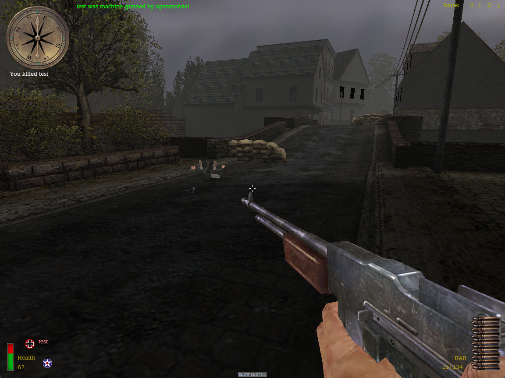
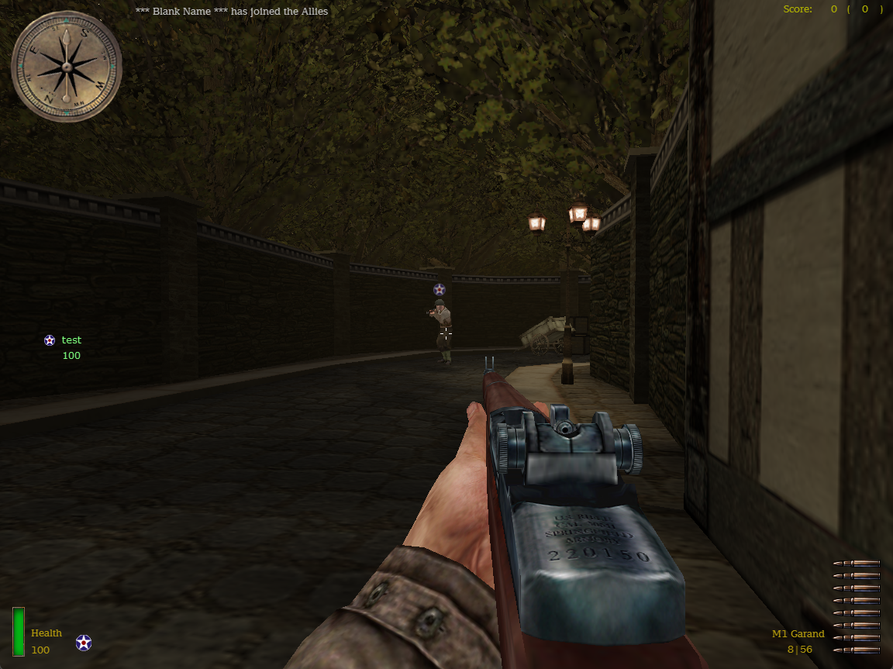
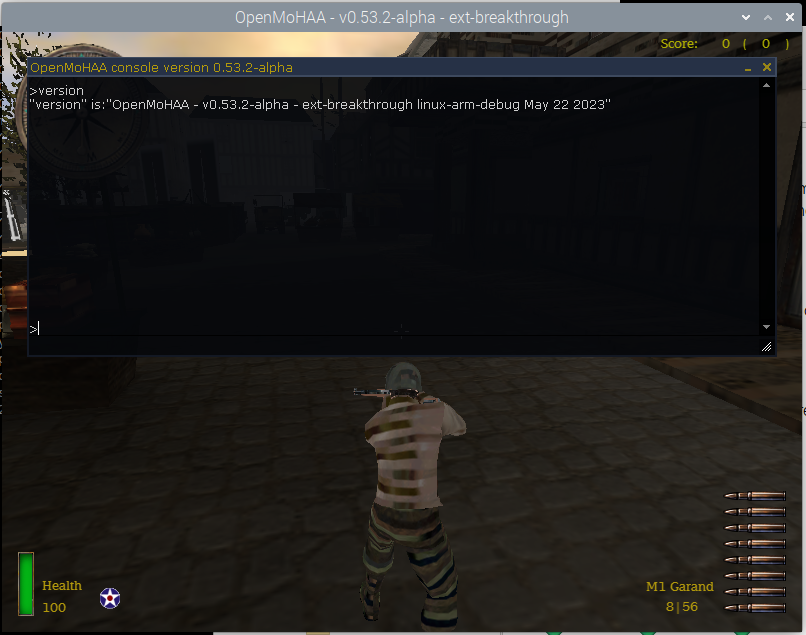
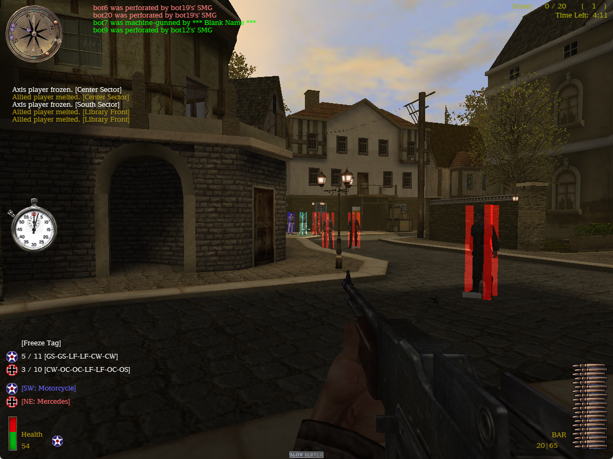
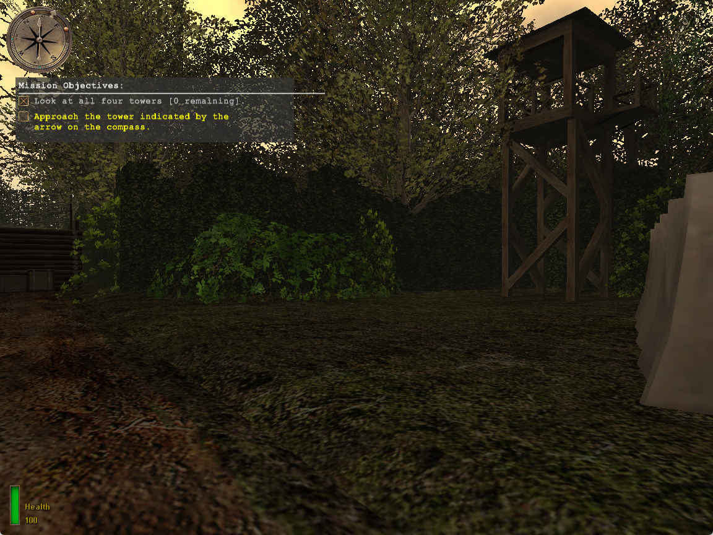

# OpenMoHAA

 [](https://github.com/openmoh/openmohaa/releases) [](https://github.com/openmoh/openmohaa/releases)

 


```
     / _ \ _ __   ___ _ __ |  \/  |/ _ \| | | |  / \      / \
    | | | | '_ \ / _ \ '_ \| |\/| | | | | |_| | / _ \    / _ \
    | |_| | |_) |  __/ | | | |  | | |_| |  _  |/ ___ \  / ___ \
     \___/| .__/ \___|_| |_|_|  |_|\___/|_| |_/_/   \_\/_/   \_\
          |_|
```

## Current State

OpenMoHAA is still under development. The single-player campaign is not yet functional due to AI not being fully implemented, and due to the script engine having a few issues. But the `training` map can be played from start to end. The current focus is on multiplayer.

## Running

Backup existing mohaa files, **cgamex86.dll** and **gamex86.dll** (set their extension to **.bak**)

a) extract archive to your MOHAA installation directory.

-or-

b) Copy all pak*.pk3 files and the sound/ directory from your **MOHAA/main** directory into openmohaa's 'main' directory.

If you have problems running the game :

You may need to install Microsoft Visual C++ 2015/2017/2019/2022 Redistributable from

https://learn.microsoft.com/en-US/cpp/windows/latest-supported-vc-redist?view=msvc-170

You can now start a local OpenMOHAA server or play on a server.

**Medal of Honor: Allied Assault Spearhead** and **Medal of Honor: Allied Assault Breakthrough** are supported in OpenMoHAA using the `com_target_game` variable. To play an expansion, append the following command-line arguments to the executable:

- `+set com_target_game 1` for Spearhead (mohaas/mohta)
- `+set com_target_game 2` for Breakthrough (mohaab/mohtt)

On Windows, you can create a shortcut to OpenMoHAA with these command-line arguments.
The default value of `com_target_game` is 0 for the base game.

With `com_target_game`, OpenMoHAA will support the network protocol accordingly

### Playing with bots

OpenMoHAA has a basic bot system that emulates real players. The maximum number of bots is defined by the `sv_maxbots` variable, and the number of initial bots is defined by the `sv_numbots` variable. Bots can also be added or removed using the `addbot` and `removebot` commands.

This feature is a great way to test the gameplay and mods.

## Builds

### Server

The server version can be built successfully, but some features are not functional. For example, the Actor and Vehicle systems are almost fully implemented, but they are not yet stable. This means that they may not work as expected and could cause crashes.

Overall, the server and the fgame components are almost fully implemented, but they may not be completely stable. There could be some minor bugs (and rare crashes), but the game should be playable.

### Client

The client version of OpenMoHAA has undergone partial implementation, with the cgame module being nearly completed. Credits to the SDK of **Heavy Metal: F.A.K.K. 2** both the cgame and fgame modules.

The current operational status for each component is as follow:

| Component               | Full | Almost | Half | Early | Bad | Not working | Comment                                                           |
|-------------------------|------|--------|------|-------|-----|-------------|-------------------------------------------------------------------|
| Audio                   |      |        |      |       | x   |             | Very basic implementation from Quake III                          |
| CG Module               |      | x      |      |       |     |             | Missing FX, Marks and decals                                      |
| Client                  |      | x      |      |       |     |             | Missing GameSpy, server list, binds, map picker, ...              |
| Collision               | x    |        |      |       |     |             |                                                                   |
| Model/TIKI/Skeletor     | x    |        |      |       |     |             |                                                                   |
| Renderer                |      | x      |      |       |     |             | Missing ghost, marks, sphere lights, sky portal, sun flare, swipe |
| Server                  |      | x      |      |       |     |             | Probably a few bugs remaining                                     |
| Server module (fgame)   |      | x      |      |       |     |             | Actor, vehicle, and few gameplay bugs                             |
| UI                      |      |        | x    |       |     |             | Has core features only (menu, widgets, console, hud, urc loading) |

## Compiling

OpenMoHAA supports any architecture, thanks to the CMake build system and cross-platform code/libraries. While the most common little-Endian architectures (arm, aarch64, x86, x86_64) have been tested and confirmed to work, big-Endian architectures should be supported as well; however, they remain untested.

The following tools are required for all platforms:
- CMake >= 3.5
- Flex and Bison
- A C++11 compiler is also required.

The installation directory can be set to the MOHAA directory.

By default, the build will produce both the client and dedicated server versions. The client build can be excluded by appending `-DBUILD_NO_CLIENT=1` to the CMake command-line arguments. Using this parameter will result in only the server portion being built.

### Linux

These are the tools required on Linux :
- Clang >= 3.3 or GCC >= 4.8.1

**clang-3.5** and **gcc-4.8.5** should work (tested on Ubuntu 16.04). Use the latest possible version of those compilers.

SDL2 library is required (libsdl2-dev).

1 line install command with latest clang version : `sudo apt-get install -y ninja-build cmake make clang-15 lld-15 flex bison libsdl2-dev`

Example with **CMake**, **clang-15** and **ninja-build** installed:
```sh
mkdir .cmake && cd .cmake
cmake -DCMAKE_C_COMPILER=clang-15 -DCMAKE_CXX_COMPILER=clang++-15 -G Ninja
```

### Windows

Visual Studio (2019 or 2022) is generally preferred.

Flex and Bison can be downloaded from here: https://github.com/lexxmark/winflexbison/releases/tag/v2.5.25

Append `-DFLEX_EXECUTABLE=...\win_flex.exe -DBISON_EXECUTABLE=...\win_bison.exe` to the CMake command-line to use the package from the link above.

## Screenshots

|                                                                               |                                                                      |
|-------------------------------------------------------------------------------|----------------------------------------------------------------------|
|  |                            |
|                                     |  |
|   |     |


## Third party

### SDL

http://www.libsdl.org/

### OpenAL

https://www.openal.org/

### LibMAD

http://www.underbit.com/products/mad/

### cURL

https://curl.se/

### Libogg

https://github.com/gcp/libogg

### Libvorbis

https://xiph.org/vorbis/

### Libopus

https://opus-codec.org/

## Communities

### URLs

- https://github.com/openmoh/openmohaa/
- https://mohaaaa.co.uk/AAAAMOHAA/index.php
- https://x-null.net/

### Discord

[](https://discord.gg/NYtH58R)
